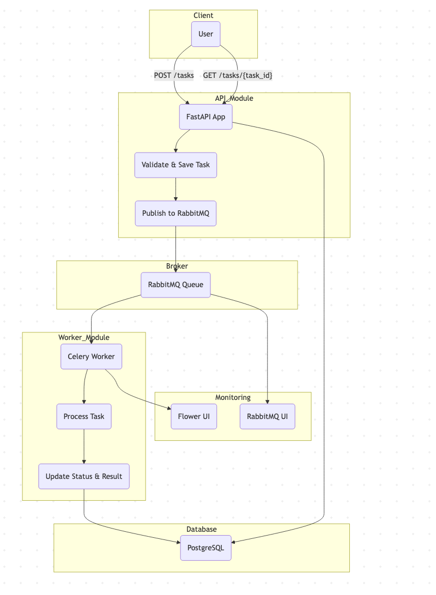

## 1. **Overall Architecture**



### 1.1. High-Level Components and Interactions

This service is composed of two main modules: the **API Module** and the **Worker Module**, both decoupled and scalable.

#### 🧩 Components:

1. **API Module (FastAPI)**
   - Exposes a REST API for clients to submit tasks and query results.
   - Validates input data using Pydantic.
   - Persists the task metadata (ID, text, status, timestamps) in a database.
   - Publishes task submission events to **RabbitMQ**.

2. **Message Broker (RabbitMQ)**
   - Acts as the asynchronous decoupling layer.
   - Holds tasks in a **durable work queue** until a worker is available.
   - Supports routing and delivery guarantees (e.g., `acks_late`, dead-letter queues).

3. **Worker Module (Celery Workers)**
   - Subscribes to the task queue.
   - Retrieves and processes tasks asynchronously.
   - Executes text analysis (e.g., word count, top-5 words).
   - Updates the task status and result in the database.
   - Handles retries, failures, and timeout enforcement.

4. **Database (PostgreSQL)**
   - Stores task metadata, including ID, status (`PENDING`, `PROCESSING`, `COMPLETED`, `FAILED`), input text, results, retry count, timestamps, and error messages.

5. **Monitoring & Observability (optional)**
   - **Flower**: to monitor Celery worker states and task history.
   - **RabbitMQ UI**: to monitor queues, message rates, and failures.

#### 🔄 Flow Summary:

```text
[Client]
   │
POST /tasks ─────────────────────────▶ [FastAPI]
   │                                       │
   │         Save task (PENDING)          ▼
   │                             [Database ←→ RabbitMQ]
   │                                       ▲
GET /tasks/{id} ◀───────────── Update status/result
   │                                       │
   ▼                                     [Celery Workers]
 [Client]                             (Processes & updates DB)
